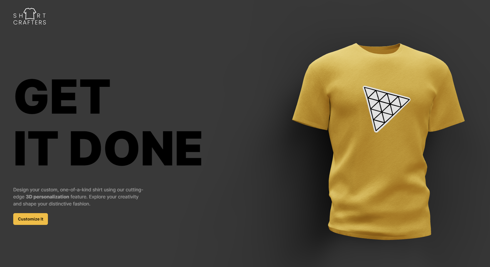
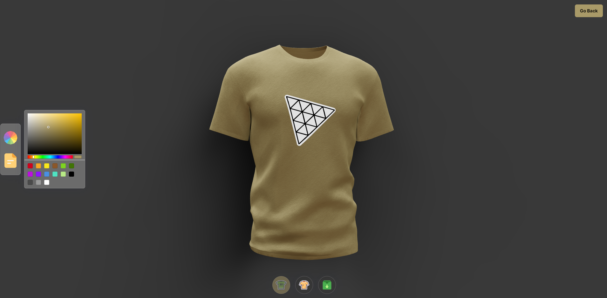

<!-- TABLE OF CONTENTS -->

# 📗 Table of Contents

- [📖 About the Project](#about-project)
  - [🛠 Built With](#built-with)
    - [Tech Stack](#tech-stack)
    - [Key Features](#key-features)
  - [🚀 Live Demo](#live-demo)
  - [🚀 Video Demo](#video-demo)
- [👥 Authors](#authors)
- [🔭 Future Features](#future-features)
- [🤝 Contributing](#contributing)
- [⭐️ Show your support](#support)
- [🙏 Acknowledgements](#acknowledgements)
- [📝 License](#license)

<!-- PROJECT DESCRIPTION -->

# 📖 [Shirt Crafters] 

### Welcome to Shirt Crafters, the ultimate shirt editing website that empowers you to unleash your creativity and design the shirt of your dreams! Our user-friendly platform offers a seamless and enjoyable experience, allowing you to customize every aspect of your shirt, and then conveniently download the final masterpiece.

## 🛠 Built With 

- Next js
- React-three-fiber

Client

  <ul>
    <li><a href="https://nextjs.org/">Next JS</a></li>
    <li><a href="#">react-three-fiber</a></li>
    <li><a href="#">framer-motion</a></li>
    <li><a href="#">maath</a></li>
    <li><a href="#">react-color</a></li>
  </ul>

<!-- Features -->

### Key Features 

- **[3d website]**
- **[Responsive]**
- **[Amazing shirt customization]**

(<a href="#readme-top">back to top</a>)

<!-- LIVE DEMO -->

## 🚀 Live Demo 

<a href="https://3d-project-qrui.vercel.app/">Live demo</a>

## 🚀 Video Demo 

<a href="https://drive.google.com/file/d/1tKjKqU8tPOpKfcA4chwxM_ZGJFcYVQXu/view?usp=sharing">Video demo</a>

(<a href="#readme-top">back to top</a>)

<!-- AUTHORS -->

## 👥 Authors 

👤 Shayan

- GitHub: [@githubhandle](https://github.com/shayan1234554321)
- Twitter: [@twitterhandle](https://twitter.com/shayan123455432)
- LinkedIn: [LinkedIn](https://www.linkedin.com/in/shayan-khan20/)

(<a href="#readme-top">back to top</a>)

<!-- FUTURE FEATURES -->

## 🔭 Future Features 

- [ ] **[More editing options]**

(<a href="#readme-top">back to top</a>)

<!-- CONTRIBUTING -->

## 🤝 Contributing 

You can contribute to this project by writing an issue <a href="https://github.com/shayan1234554321/3d-project/issues" >here</a>

(<a href="#readme-top">back to top</a>)

<!-- SUPPORT -->

## ⭐️ Show your support 

If you like this project please leave a ⭐️

(<a href="#readme-top">back to top</a>)

<!-- ACKNOWLEDGEMENTS -->

## 🙏 Acknowledgments 

I would like to thank <a href="https://www.youtube.com/@javascriptmastery" >Javascript Mastery</a> for the great follow up.

(<a href="#readme-top">back to top</a>)

<!-- LICENSE -->

## 📝 License 

This project is [MIT](./LICENSE) licensed.

(<a href="#readme-top">back to top</a>)

